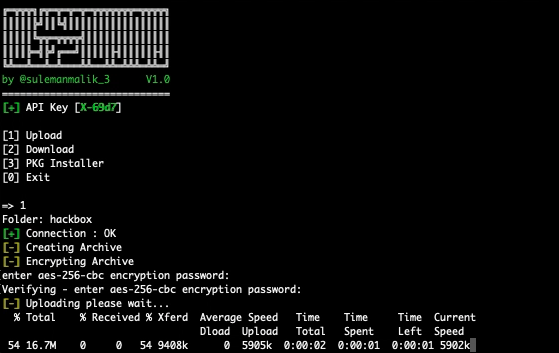

# ASSAMEE
ASSAMEE is a free Advance encryptor for Anonfiles. It uses an advanced encryption method to encrypt the directory with AES-256. The data will store on anonfiles.com in an encrypted format. The ASSAMEE requires a download ID to download and decrypt the data from Anonfiles. Downloading encrypted data directly from anon files via a browser will not work. 

ASSAMEE Required Packages. 
- Zip
- Curl
- openssl
- jq

The above-required files need to install with the PKG installer option in ASSAMEE console.

# Operating System
ASSAMEE Works perfectly on the operating system listed below.
- MacOs Big sur v11.6.4
- Kali 2.0 and above
- Parrot Linux
- Ubuntu

# Anonfiles API Key
Get Your API_KEY from https://anonfiles.com/register
- First, register yourself, and you will get ***100GB*** of storage.
- Login to Anonfiles and grab your API key from <a href="https://anonfiles.com/docs/api" >here</a>
- Open ASSAMEE.sh with your favorite text editor and paste the API Key in the Anon_key variable.

# Usage

```
git clone https://github.com/samhaxr/ASSAMEE
cd ASSAMEE
chmod +x ASSAMEE.sh
sh ASSAMEE.sh
```

# Youtube Tutorial
[](https://www.youtube.com/watch?v=NnQsjZKJBUI&feature=youtu.be)
